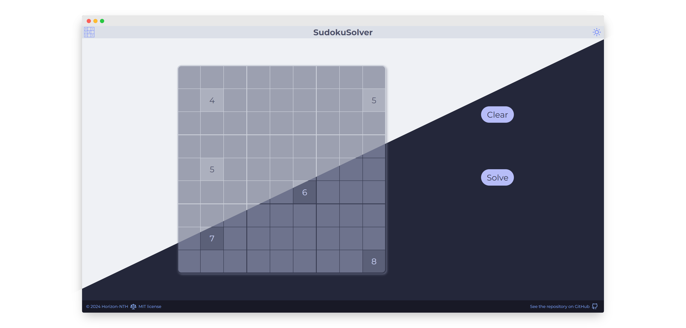

# SudokuSolver

**SudokuSolver** is a simple and intuitive website that helps you solve Sudoku puzzles.  
It features both dark and light themes using the beautiful [Catppuccin](https://catppuccin.com/) color scheme.

## Features

- **Sudoku Solver**: Easily input your Sudoku puzzle and get the solution instantly.
- **Dark and Light Modes**: Toggle between dark and light themes to suit your preference.
- **Responsive Design**: Optimized for both desktop and mobile devices.
- **User-Friendly Interface**: Simple and clean interface for a seamless user experience.